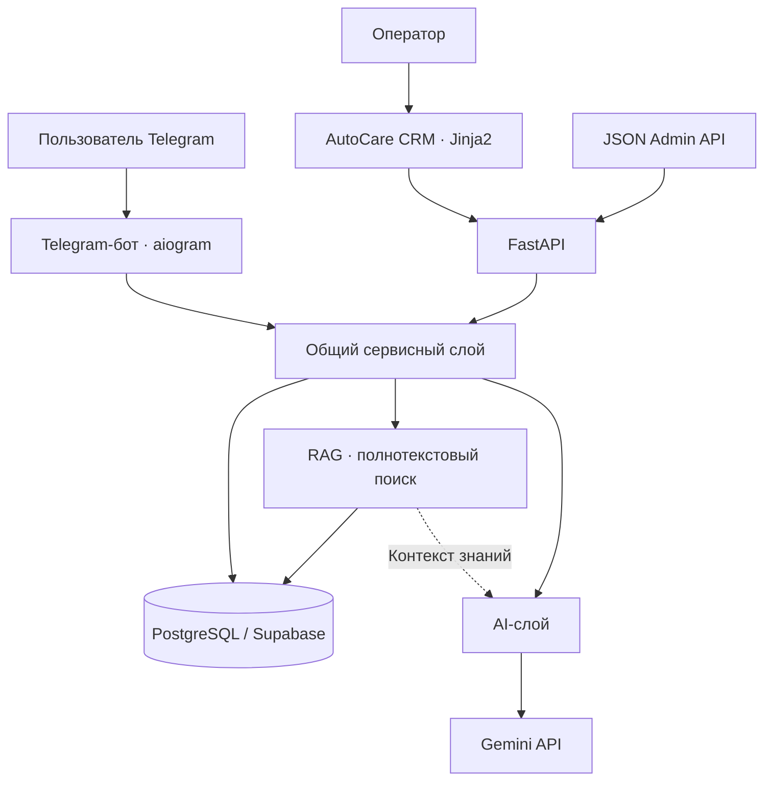

# Auto AI Service Agent

**Auto AI Service Agent** — пет-проект для вымышленного автосервиса **AutoCare**. Он объединяет Telegram AI-помощника, запись на обслуживание, сохранение диалогов, базу знаний с RAG, передачу обращения человеку и веб-интерфейс оператора.

Это работающий локальный MVP и эксперимент с AI-assisted development, а не коммерческая система действующего автосервиса.

## Зачем я сделала этот проект

Этот проект я создала в первую очередь как эксперимент с **AI-assisted development и форматом vibe coding**. Мне было интересно пройти разработку поэтапно. Использовать ChatGPT как технического наставника и лида, а Codex как инструмент реализации конкретных задач в репозитории.

ChatGPT помогал обсуждать архитектуру, объяснять назначение технологий, разбивать работу на небольшие этапы и готовить технические задания. Codex реализовал многие из этих задач в коде.

Моя роль заключалась в управлении разработкой. Я выбирала требования и архитектурные решения, настраивала внешние сервисы, запускала приложение локально, проверяла интеграции и сценарии через Telegram и CRM. Я разбирала ошибки, проверяла результаты, работала с базой данных и миграциями, запускала тесты и управляла коммитами и отправкой изменений через Git.

Мне было важно не только получить результат, но и разобраться, как работает созданный код. Для меня этот репозиторий одновременно MVP и практический опыт: насколько далеко можно продвинуть проект с помощью современных AI-инструментов и почему при таком подходе необходимо понимать архитектуру и проверять реализацию.

## Что умеет проект

- **Telegram-бот на русском языке:** меню, пошаговые формы, валидация, отмена и понятные сообщения об ошибках.
- **Пользователи:** `/start` создаёт или обновляет профиль по Telegram ID без дублирования пользователя.
- **Автомобили:** добавление марки, модели, года и необязательного госномера; просмотр только своих автомобилей.
- **Каталог:** активные услуги из PostgreSQL, описание, длительность и цена в EUR либо «Цена по запросу».
- **Запись на сервис:** выбор своего автомобиля, активной услуги, даты и времени кнопками; сохранение только после подтверждения; просмотр ближайших записей.
- **AI-консультация:** диалог с Gemini о симптомах автомобиля, возможных причинах и необходимых уточнениях.
- **Память и RAG:** сохранение сообщений, ограниченный контекст диалога и поиск по внутренней базе знаний AutoCare.
- **Передача оператору:** обращение со ссылкой на диалог и кратким резюме; локальное резервное резюме при недоступности AI.
- **CRM:** защищённый JSON API и серверный веб-интерфейс для просмотра обращений, истории, автомобилей клиента и изменения статуса.

## Как выглядит система



Telegram и CRM разные интерфейсы над общей логикой и данными. Обработчики отвечают за ввод и вывод, сервисы за сценарии и правила, ORM за хранение, AI-слой за взаимодействие с моделью.

SQLAlchemy остаётся синхронным. Telegram вызывает операции с БД и AI через `asyncio.to_thread()`. Синхронные HTTP-маршруты FastAPI выполняются в пуле потоков. Транзакции БД не удерживаются во время ожидания Gemini.

## Пример пользовательского сценария

1. Пользователь выбирает «Описать проблему» и описывает вибрацию при торможении.
2. Сообщение сохраняется в текущем диалоге.
3. RAG ищет подходящие фрагменты знаний AutoCare по текущему вопросу.
4. Gemini получает недавнюю историю и найденные знания, затем формирует ответ на русском.
5. Пользователь нажимает «Связаться с оператором».
6. Создаётся обращение с резюме разговора. При ошибке Gemini используется локальная выписка из истории.
7. Оператор входит в CRM, открывает обращение и читает резюме, сообщения и сведения об автомобилях.
8. Оператор переводит обращение в работу, а затем отмечает решённым или отменённым.

Само обращение не отправляет уведомление оператору: он просматривает его в CRM. Диалог с AI после передачи остаётся доступен.

## Технологии

| Технология | Роль в проекте |
| --- | --- |
| Python | Основной язык; асинхронные Telegram-обработчики и синхронные прикладные сервисы |
| aiogram 3 | Telegram long polling, маршрутизация, клавиатуры и FSM |
| PostgreSQL / Supabase | Хранение пользователей, автомобилей, записей, диалогов, знаний и обращений |
| SQLAlchemy 2 | Типизированные ORM-модели, запросы и транзакции |
| psycopg 3 | Драйвер подключения к PostgreSQL |
| Alembic | Версионирование схемы базы данных |
| Google Gemini / google-genai | Диагностические ответы и отдельный сценарий резюмирования для оператора |
| PostgreSQL Full-Text Search | Лексический поиск по русскоязычной базе знаний |
| FastAPI / Uvicorn | HTTP-приложение, JSON API и запуск ASGI-сервера |
| Pydantic | Явные схемы запросов и ответов Admin API |
| Jinja2 и локальный CSS | Серверный HTML-интерфейс CRM без Node.js и фронтенд-фреймворка |
| itsdangerous | Подпись идентификаторов веб-сессий |
| python-multipart | Разбор HTML-форм входа и изменения статуса |
| python-dotenv | Загрузка локальной конфигурации из `.env` |
| unittest | Автоматические тесты с изолированными БД и подменой внешних вызовов |

Прямые зависимости закреплены в `requirements.txt`. Pydantic используется через зависимости существующего стека. В локальной разработке использовался Python 3.14; формальная матрица поддержки версий Python в репозитории не задана.

## Структура проекта

```text
app/
├── bot/                 # Telegram: обработчики, клавиатуры, состояния FSM
├── services/            # Прикладные сценарии и бизнес-правила
├── database/            # ORM-модели, engine и фабрика сессий
├── ai/                  # Gemini-клиент, промпты, ответы и резюме
├── rag/                 # Чанкинг, загрузка и поиск знаний
├── api/                 # FastAPI, JSON-маршруты, схемы и API-авторизация
├── web/                 # Веб-сессии, HTML-маршруты, шаблоны и CSS CRM
├── config/              # Конфигурация из окружения
└── security.py          # Сравнение ключей доступа
knowledge_base/          # Исходные Markdown-документы AutoCare
alembic/                 # Настройка и версии миграций
scripts/                 # Ручная загрузка услуг и знаний
tests/                   # Изолированные автоматические проверки
main.py                  # Точка входа Telegram-бота
requirements.txt
.env.example
```

## База данных

В проекте PostgreSQL размещён на Supabase. Supabase используется как хостинг PostgreSQL: приложение подключается через psycopg и SQLAlchemy, без Supabase Python SDK. Для локальной разработки можно использовать отдельный PostgreSQL.

Telegram и CRM работают с одной схемой:

| Таблица | Назначение |
| --- | --- |
| `users` | Профили, уникальный Telegram ID |
| `vehicles` | Автомобили, принадлежащие пользователям |
| `services` | Каталог, стоимость, длительность и активность услуг |
| `appointments` | Записи пользователя на выбранную услугу и автомобиль |
| `conversations` | Диагностические диалоги пользователя |
| `messages` | Сообщения клиента и AI в диалоге |
| `knowledge_chunks` | Фрагменты знаний с источником, заголовком и категорией |
| `support_requests` | Обращения оператору, статус и резюме |

Цены хранятся в `Numeric` и обрабатываются через `Decimal`. Временные отметки используют PostgreSQL-типы с часовым поясом. Принадлежность автомобилей и диалогов проверяется в сервисах.

В репозитории четыре последовательные миграции: исходная схема → диалоги и сообщения → база знаний → обращения оператору. Текущая вершина цепочки `20260920_0004`.

## AI и память диалога

Gemini вызывается только через AI-слой. Диагностический ответ запрашивается по JSON-схеме, проверяется приложением и преобразуется в русские разделы «Возможные причины», «Вопросы» и «Рекомендация».

В коде настроены основной `gemini-3.8-flash` и резервный `gemini-3.5-flash`. Это текущие константы проекта, а не гарантия доступности моделей для любого аккаунта. Для временных HTTP-ошибок предусмотрены две дополнительные попытки с задержками; переход на резервную модель происходит только после исчерпания попыток с итоговым HTTP 503.

Диалоги и сообщения сохраняются в PostgreSQL. Для обычного ответа используется до **10 последних сообщений**, включая текущий вопрос (`MAX_CONTEXT_MESSAGES`). Сообщение клиента сохраняется до обращения к AI, ответ помощника только после успешной генерации и проверки. При ошибке провайдера история не удаляется, а техническое сообщение об ошибке не сохраняется как совет AI.

Перезапуск бота сохраняет записи в БД, но не восстанавливает активное состояние FSM. Автоматического продолжения старого диалога после перезапуска сейчас нет.

Помощник объясняет возможные причины и задаёт вопросы; он не устанавливает окончательный диагноз. Промпты предусматривают осторожность при опасных симптомах и рекомендацию профессионального осмотра.

## RAG

Первая версия RAG использует **PostgreSQL Full-Text Search**, без embeddings, pgvector и внешнего embedding API.

Исходные русскоязычные документы находятся в `knowledge_base/`: тормоза, масло, шины, кондиционер, компьютерная диагностика, запись и общие вопросы AutoCare. Это тексты для вымышленного сервиса.

Ручная загрузка разбивает Markdown по заголовкам, нормализует пробелы и ограничивает размер фрагмента. В `knowledge_chunks` сохраняются источник, заголовок, содержание, категория и признак активности. Повторная загрузка неизменённых файлов не создаёт дубликаты; изменившиеся источники заменяются в транзакции. Отсутствующий в каталоге файл не удаляет уже загруженные данные автоматически.

Поиск использует русскую конфигурацию PostgreSQL, GIN-индекс и ранжирование совпадений. Запросом служит текущее сообщение пользователя. В AI передаются только активные фрагменты — не более **4** (`MAX_RAG_CHUNKS`), отдельно от истории разговора. Найденные знания не записываются в `messages`.

Если совпадений нет или поиск временно недоступен, диагностический сценарий может продолжиться без RAG. Семантический или гибридный поиск остаётся возможным следующим этапом.

## Передача оператору

Кнопка связи с оператором доступна в диагностическом диалоге. Сервис проверяет владельца разговора и создаёт `SupportRequest` со статусом `new`, ссылками на пользователя и диалог, а также кратким резюме.

Для резюме используется отдельный промпт и схема ответа. Контекст ограничен **30 сообщениями** (`MAX_HANDOFF_MESSAGES`): началом разговора и последними уточнениями, в хронологическом порядке. При недоступности Gemini локальная функция составляет выписку из первого сообщения клиента, последующих уточнений и последнего ответа AI. Пустой диалог также допускает обращение без выдуманных симптомов.

Для одного разговора допускается только одно активное обращение (`new` или `in_progress`). Это проверяется сервисом и частичным уникальным индексом PostgreSQL. Резюме снимок контекста на момент создания; исходные сообщения остаются на месте, AI-диалог можно продолжать.

Допустимые переходы централизованы:

| Текущий статус | Следующие статусы |
| --- | --- |
| `new` | `in_progress`, `resolved`, `cancelled` |
| `in_progress` | `resolved`, `cancelled` |
| `resolved`, `cancelled` | Переходов нет |

Повторная установка текущего статуса допустима. Операторские уведомления и отправка ответа клиенту из CRM пока не реализованы.

## AutoCare CRM

Одна точка входа `app.api.app:app` обслуживает два интерфейса:

- **JSON Admin API** — программный доступ под `/api/admin`, защищённый заголовком `X-Admin-Key`.
- **Веб-CRM** — русскоязычные серверные страницы под `/admin`, вход через `/admin/login`.

CRM показывает список обращений с фильтром статуса и пагинацией, резюме, данные клиента, его автомобили и историю сообщений. В карточке доступны только допустимые действия со статусом. После изменения применяется POST/Redirect/GET. API и страницы используют один сервис обращений.

| HTTP-маршрут | Назначение |
| --- | --- |
| `GET /health` | Публичная проверка работы HTTP-приложения, без проверки БД |
| `GET /api/admin/support-requests` | Список: `status`, `limit` и `offset`; по умолчанию 20, максимум 100 |
| `GET /api/admin/support-requests/{request_id}` | Карточка с пользователем, диалогом, сообщениями и автомобилями |
| `PATCH /api/admin/support-requests/{request_id}/status` | Изменение статуса по доменным правилам |

Запуск FastAPI не запускает Telegram, и наоборот. CRM не требует работающего процесса бота для просмотра уже сохранённых данных.

## Безопасность

Секреты загружаются из окружения или локального `.env`; `.env` исключён из Git. В репозитории есть только шаблон конфигурации.

Admin API проверяет ключ из заголовка с помощью сравнения за постоянное время. Веб-вход использует тот же настроенный ключ, но отдельную сессионную авторизацию: подписанная cookie содержит случайный идентификатор, а не исходный `ADMIN_API_KEY`. Cookie имеет `HttpOnly` и `SameSite=Lax`; для HTTPS предусмотрен флаг `Secure`.

Все изменяющие HTML-формы, включая вход и выход, защищены CSRF-токеном. Выход отзывает серверную сессию. Шаблоны экранируют клиентский текст; приватные страницы получают `Cache-Control: no-store`. Ошибки приложения не возвращают пользователю SQL, ключи и исходные исключения провайдера. Разрешающий все источники CORS не включён.

Это **авторизация уровня портфолио-MVP с общим ключом**, а не полноценная система учётных записей и ролей операторов. Для реального многопользовательского CRM потребуются отдельные пользователи, права доступа и дальнейшая работа над эксплуатационной безопасностью.


## Что я хотела изучить

Мне хотелось связать в одном проекте несколько практических тем: архитектуру нетривиального Python-приложения, разделение интерфейсов и бизнес-логики, PostgreSQL, ORM и миграции, внешние API, RAG и обработку отказов.

Отдельной целью были тестирование и развитие системы от Telegram-бота до HTTP API и операторского интерфейса без дублирования основных правил. В работе с AI-инструментами я училась формулировать небольшие проверяемые задачи, читать полученный код, замечать ограничения и проверять результат, а не считать сгенерированное решение автоматически правильным.

## Возможное развитие

Идеи для следующих этапов, пока не реализованные:

- Telegram Mini App или другой клиент поверх общего сервисного слоя;
- семантический либо гибридный поиск для RAG;
- голосовые сообщения и распознавание речи;
- индивидуальные аккаунты операторов и роли;
- аналитика обращений и оценка качества AI-ответов;
- подготовка и проверка развёртывания.
